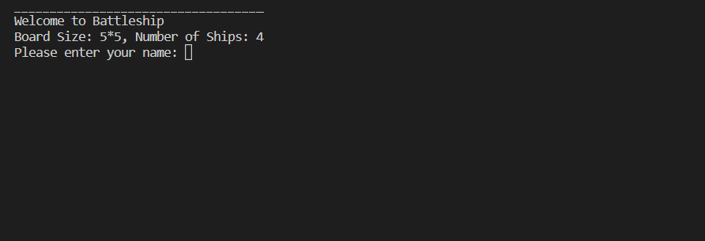
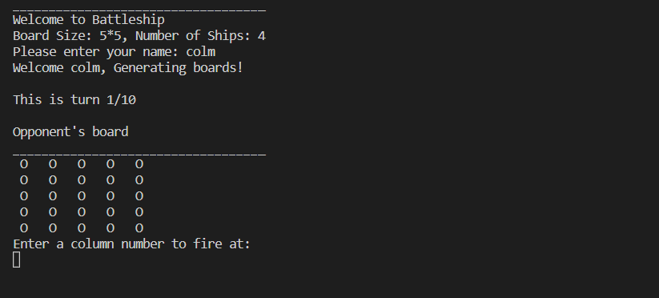
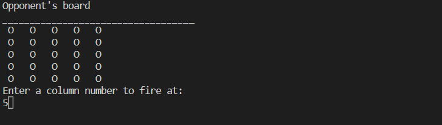
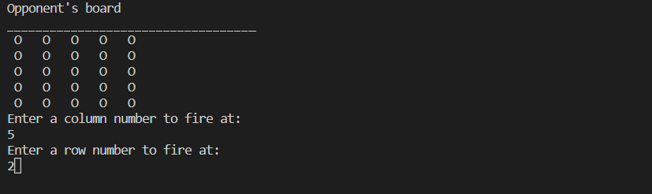
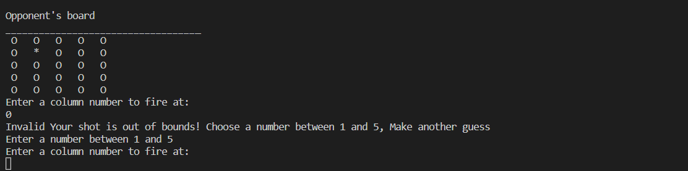
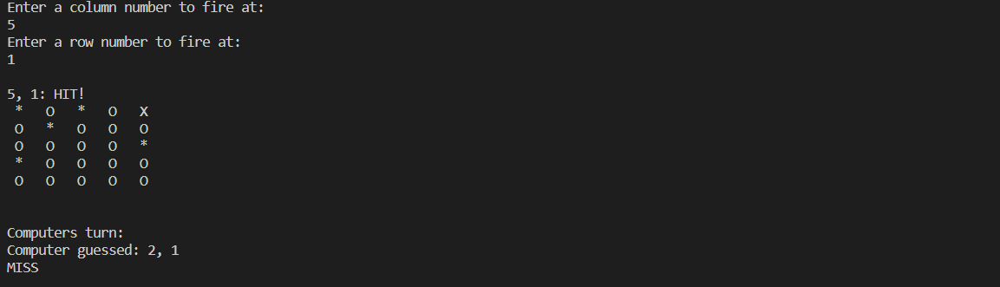
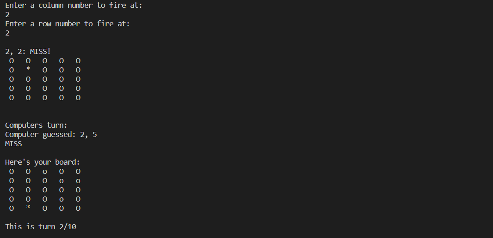

# Object Oriented Python: Battleship Game

Welcome,

Everyone knows the game of **Battleship** and is familiar with the rules. You will find here a representation of the Battleship game run through a Python terminal. This terminal is running on Heroku.

The purpose of the game is for the users to find all the computer ships (5 ships) before the player runs out of tries/bullets/guesses. The player has ten guesses to find as many ships as possible. The player with the most hits at the end of the ten guesses is the winner. Each ship occupies one square on the grid.

[View the live version of the programme running on Heroku]()

## Table of Contents

- [How to play](#how-to-play)
- [Features](#features)
    - [Implemented features](#implemented-features)
    - [Future Features](#future-features)
- [Data Model](#data-model)
- [Testing](#testing)
    - [User Goals](#user-goals)
    - [Technology](#technology)
- [Bugs](#bugs)
    - [Fixed Bugs](#fixed-bugs)
    - [Validator Testing](#validator-testing)
- [Testing](#testing)
- [Credits](#credits)

## How to play
Battleship is a turn-based naval strategy game. Originally known as a pencil and paper game, the game has evolved in its format and has its own variations. You can find out more about this game and its history on its [Wikipedia page](https://en.wikipedia.org/wiki/Battleship_(game)#:~:text=Battleship%20(also%20known%20as%20Battleships,concealed%20from%20the%20other%20player.).

In this version of the game, the player sees the guess board. This is a one player game where the player has to try and sink all the ennemy ships before he is running out of tries. 

Each turn, the user will be select to select a row and a column that will work as coordinates to target a location on the grid. The outcome of this selection will display a "O" for a missed shot, or water, or a "X" for a hit. Locations that have not been hit yet are marked on the grid by a "_".

## Features

### Implemented features

- Introduction message explaining the programme, the board size, number of ships and requesting players name:

- The grid with the numbers for the rows and the letters for the columns to guide the player in how to select locations. The printing will iterate for the number of columns. The 5 ennemy ships are randomly generated on the grid (but of course not displayed):

- asks player to input a column number
(

- asks player to enter row number

- Logic to verify the input for rows and columns.
    - Verifies if the row input is an integer.
    - Converts the row input in coordinates (substracts 1)
    - Verifies if the column is a letter.
    - Converts the letter in a number.
    - Returns error message to player

- Outcome logic after input has been validated
    - Verifies if the selected coordinates have not been previously hit.
    - Checks on the grid if an ennemy ship is located there.
    - Checks on the grid if it is an empty location. 
    - Reduces the count of tries left by one.

### Future Features

Imagination can go a long way. Battleship, through its variations, is a good display of that. Due to time constraints, I could not implement all the features I wanted to make available for the players. These features may be released in future updates:

- [ ] Add a player grid to display the ships,
- [ ] Add different ship lengths and allow different directions for ship placement,

## Data Model
 

## Testing

- PEP8
    - No problems were identified from [PEP8 Online Check](Assets/images/Testing.png)

### User goals

**Goal**                               
               

### Technology

The code is passing the PEP8 linter validation. No errors were identified. 

## Bugs

### Fixed Bugs

### Validator testing

- PEP8
    - No problems were identified from [PEP8 Online Check](Assets/images/Testing.png)

## Deployment

This project was deployed using Code Institute's mock terminal for Heroku.

  - Steps for deployment:
    - Create a copy of the [Python Essentials Template](https://github.com/Code-Institute-Org/python-essentials-template) repository
    - Freeze the requirements.txt
    - Create a new [Heroku](https://dashboard.heroku.com/apps) app.
    - Set the buildbacks to `Python` and `NodeJS` in that order.
    - Link the Heroku app to the repository (in the read.me)
    - Click on `__Deploy__`.

## Credits

- Several ressources were identified in helping creating the Battleship game. [DioCar84's Battleship project](https://en.wikipedia.org/wiki/Battleship_(game)) of the CodeInstitue was a good source of inspiration for the data model. 
- Austin Montgomery's [Python for Beginners: Battleship](https://bigmonty12.github.io/battleship) was a step by step guide that helped me throughout fixing some of the bugs I encountered.
- [CaringTiger's Battleship repo](https://github.com/caringtiger/battleships/blob/master/main.py#L7).
- [StackOverflow](https://stackoverflow.com/) was a great source for identifiying technical challenges I was facing and for helping to move forward.
- Quinto's question on [StackOverflow](https://stackoverflow.com/questions/36609140/how-to-make-this-battleship-game-more-user-friendly-in-terms-of-values)
- [How to Code Battleship in Python - Single Player Game](https://www.youtube.com/watch?v=alJH_c9t4zw) Video
- [Catching Exceptions With try and except](https://realpython.com/lessons/catching-exceptions-try-except/)
- My mentor, Ronan. A great help in moving forward and identfying the appropriate resources.
- My friends Greg and Colm for their support on the final steps of the projet and helping bring some perspective on some of the functions (looking at you `print_game_board_grid()` and `generate_ships()`).
- [Wikipedia](https://en.wikipedia.org/wiki/Battleship_(game)) for the rules and history of the Battleships game